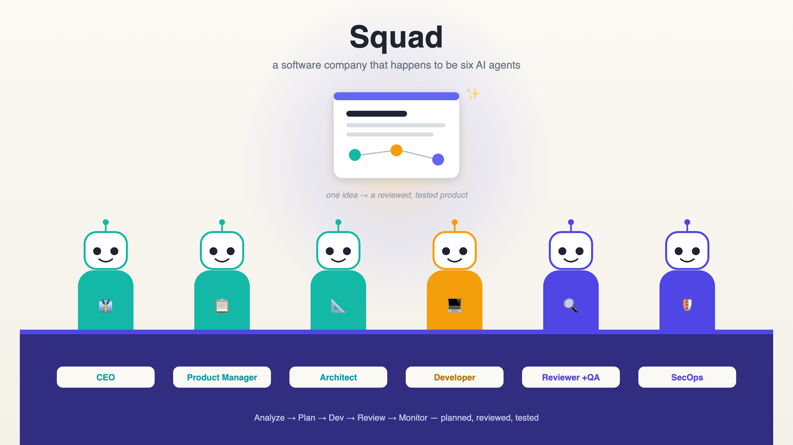
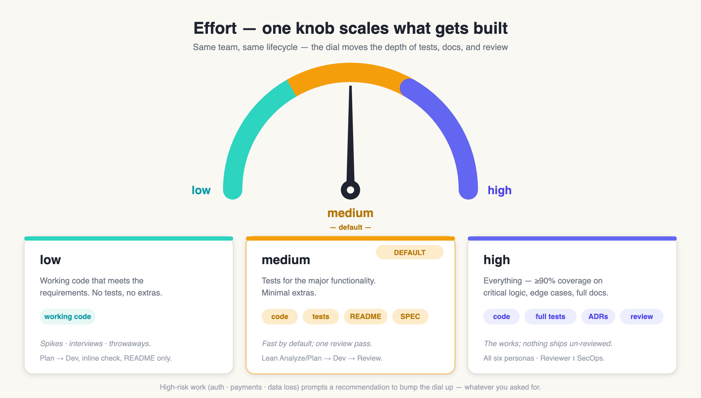
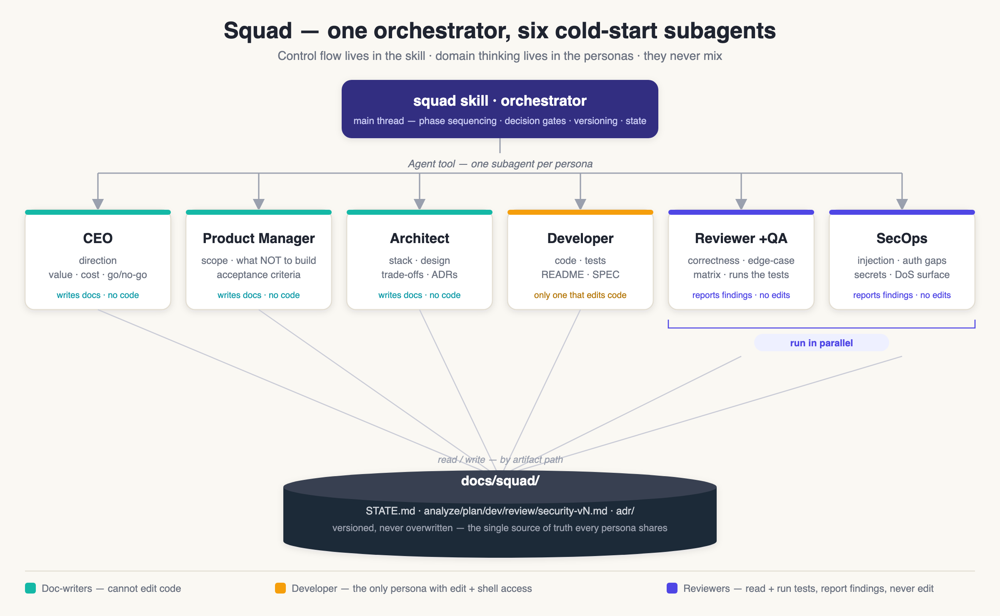
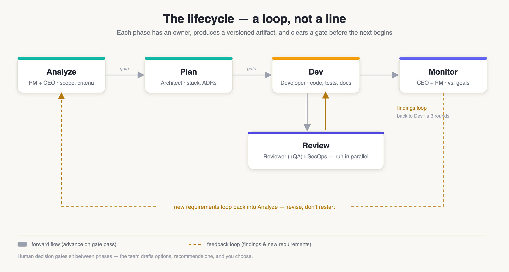
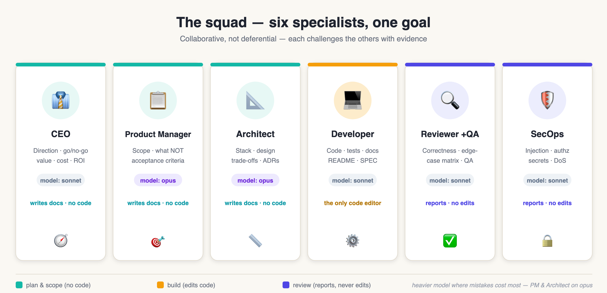

# Squad Skill

Runs a full software development lifecycle — **Analyze → Plan → Dev → Monitor** — as a small,
opinionated software company. The skill is the **orchestrator**; the real work is done by six
persona **subagents** it delegates to.



## What it does

You give it product context and requirements. It asks clarifying questions first, picks an
**effort** level (see below), then drives the lifecycle: defining scope, choosing a stack and
architecture, implementing with tests, and gating the result through a quality + security review
before "go live". Everything is documented as versioned artifacts under `docs/squad/`, and new
requirements loop back into Analyze rather than restarting.

## Effort modes

One knob controls how much gets built and how heavy the process is. If you don't specify one, it
defaults to **medium** and tells you which it's running.

| Effort | What ships | Process weight |
|---|---|---|
| **low** | Working code that meets the requirements — no tests, no extras. | Plan → Dev only, inline sanity check, `README.md` only. Fast; good for spikes, interviews, throwaways. |
| **medium** *(default)* | Code + tests for the major functionality; minimal extras. | Lean Analyze/Plan → Dev → one Reviewer pass. `README.md` + `SPEC.md`. |
| **high** | Everything — ≥90% coverage on critical logic, edge cases, ADRs, full docs. | All six personas, Reviewer + SecOps in parallel, up to 3 review rounds. |

Say *"low effort"*, *"quick"*, or *"the works / production-grade"* to pick; high-risk work
(auth, payments, data loss) prompts a recommendation to bump up regardless.



Separately from the internal `docs/squad/` trail, once the code works the Developer writes durable
docs at the project root: a **`README.md`** (what it is, how to run, how-tos) always, plus a
**`SPEC.md`** (architecture, components, data model, interfaces, decisions, failure modes) at
medium and high.

It is **stack-agnostic** — it builds backend, frontend, CLI, service, or library projects in any
language (Java/Kotlin, Python, Go, TypeScript, …). The Architect picks the tech per problem. In a
repo that already has code, the team **explores the existing patterns first** (layout, naming,
error format, test style) and builds with the grain rather than inventing a new pattern.

## Architecture

The system is a **single orchestrator plus six cold-start subagents**. Responsibilities are split
so that one component owns *control flow* and the others own *domain thinking* — they never mix.



### The two roles

- **Orchestrator (the skill).** Runs on the main thread. It does **not** do deep design or write
  production code. It sequences the phases, invokes the right persona at the right time, runs the
  human decision gates, bumps artifact versions, updates `STATE.md`, and handles escalation.
- **Personas (the subagents).** Each is a specialist invoked via the **Agent tool**. It does the
  domain work for its phase, writes its own artifact, and returns a compact structured handoff.

### Why it is built this way

- **Cold-start isolation.** Subagents share no memory with the orchestrator or with each other.
  That is deliberate: each persona reasons from a clean, focused context instead of inheriting the
  whole conversation. The orchestrator compensates by passing inputs **by artifact path** (e.g.
  *"read `docs/squad/plan-v2.md` and `docs/squad/STATE.md`"*) so every persona reads the source of
  truth rather than re-deriving it. Context stays lean and pointer-based.
- **Least-privilege tooling.** Each persona gets only the tools its role needs — CEO/PM/Architect
  write docs but **cannot edit code**; the Developer is the only persona with edit + Bash;
  Reviewer/SecOps can read and run tests/scanners but **cannot edit source** (they report findings
  back). This keeps roles honest and prevents a review agent from silently "fixing" what it should
  be flagging.
- **Reasoning where the leverage is.** The strongest model sits on **Product Manager (Analyze)**
  and **Architect (Plan)** — scope and architecture are the costliest things to get wrong.
  Execution and review roles run a capable coding model.
- **Parallelism where it is safe.** Independent personas run concurrently. In Review, `squad-reviewer`
  and `squad-secops` are invoked in the same turn (two Agent calls, one message); phases with a real
  dependency stay sequential.

### The handoff contract

Every persona returns the same structured block, which is what makes the chain reliable:

```
PHASE:      <analyze | plan | dev | review | security>
ARTIFACT:   <path written>
STATUS:     <ok | needs-user-decision | blocked | changes-requested>
SUMMARY:    <2–4 sentences>
DECISIONS:  <choices made, 1-line rationale each>
OPEN:       <questions for the user, if needs-user-decision>
FINDINGS:   <review/security only: {severity, area, issue, fix}>
NEXT:       <recommended next action>
```

The orchestrator routes on `STATUS`: `ok` → advance; `needs-user-decision` → run a decision gate;
`changes-requested` → loop back to the Developer; `blocked` → escalate to the user.

### State & versioning

All lifecycle artifacts live under `docs/squad/`:

```
docs/squad/
├── STATE.md            # current phase, active artifact versions, open decisions — the resume point
├── analyze-vN.md       # scope, acceptance criteria, success metrics
├── plan-vN.md          # architecture & tech stack (2–3 options with trade-offs)
├── dev-vN.md           # implementation notes
├── review-vN.md        # quality review outcomes + findings
├── security-vN.md      # security review outcomes + findings
└── adr/                # architecture decision records
```

The version is **bumped on every loop iteration and never overwritten**, so history stays
auditable. `STATE.md` is read on entry and updated after each phase — an interrupted run resumes
from it instead of restarting.

## How it works (the lifecycle)

The orchestrator opens with clarifying questions, picks an effort level, then runs the loop. Each
phase invokes its owner persona, collects the handoff, updates `STATE.md`, and clears a gate.



1. **Pick effort first** (low / medium / high — see the table above). It scales both what gets
   built and which personas run: low collapses to Plan → Dev with an inline check; medium runs one
   Reviewer pass; high runs the full parallel Reviewer + SecOps loop.
2. **Analyze** (`squad-product-manager`, direction from `squad-ceo`). Scope, acceptance criteria,
   success metrics → `analyze-vN.md`. **Gate:** user confirms scope.
3. **Plan** (`squad-architect`, with Developer/PM input). Tech stack + architecture, 2–3 options with
   pros/cons/cost, ADRs → `plan-vN.md` + `docs/adr/*`. On security/data-sensitive designs it
   **shifts left**, consulting SecOps (threat model) and Reviewer (testability) here. **Gate:** user
   approves the plan.
4. **Dev** (`squad-developer`). Implement to the approved plan; tests per effort (≥90% on critical
   logic at high); durable `README.md`/`SPEC.md` + `dev-vN.md`. **Gate:** build + tests pass locally.
5. **Review** (`squad-reviewer` + `squad-secops`, in parallel). Findings tagged by severity go back to
   the Developer. **Bounded loop: at most 3 Dev↔Review rounds**, then escalate. **Gate:** Definition
   of Done — build green, coverage met, zero open blocker/major findings, docs updated, acceptance
   criteria satisfied.
6. **Monitor** (`squad-ceo` + PM). Verify the output against goals. New requirements loop back into
   **Analyze** — artifacts and product are revised, not restarted.

At consequential decisions the team presents **2–3 concrete options** with trade-offs and a
recommendation, and lets the user choose. For reversible, low-stakes choices it picks a sensible
default and moves on.

## Personas (subagents)

| subagent | Role | Owns / produces |
|---|---|---|
| `squad-ceo` | CEO | Direction, value/cost/ROI, go/no-go |
| `squad-product-manager` | Product Manager | Scope, requirements, acceptance criteria → `analyze-vN.md` |
| `squad-architect` | Architect | Tech stack, architecture, ADRs → `plan-vN.md` + `adr/` |
| `squad-developer` | Developer | Implementation, tests, docs (`README.md`/`SPEC.md`) → code + `dev-vN.md` |
| `squad-reviewer` | Reviewer (+ QA) | Quality/correctness/perf gate **and QA** — runs the tests, builds an edge-case matrix → `review-vN.md` |
| `squad-secops` | SecOps | Security review gate → `security-vN.md` |



## Install

Install the `squad` plugin — it bundles this skill and the six `squad-*` personas (`../../agents/`):

```
/plugin marketplace add orhund8z/dotclaude
/plugin install squad@orhund8z
```

See the repo root [README](../../../../README.md#installation) for details.

## Design

The full specification this skill and its agents are generated from lives at
[`prompts/squad.md`](../../../../prompts/squad.md) — keep that as the source of truth and regenerate the
files when the process changes.

## Kickoff

Just describe what you want built, e.g. *"build me a URL-shortener service"* or *"run the squad on
this feature"*. The team opens with clarifying questions, then begins at **Analyze**.
